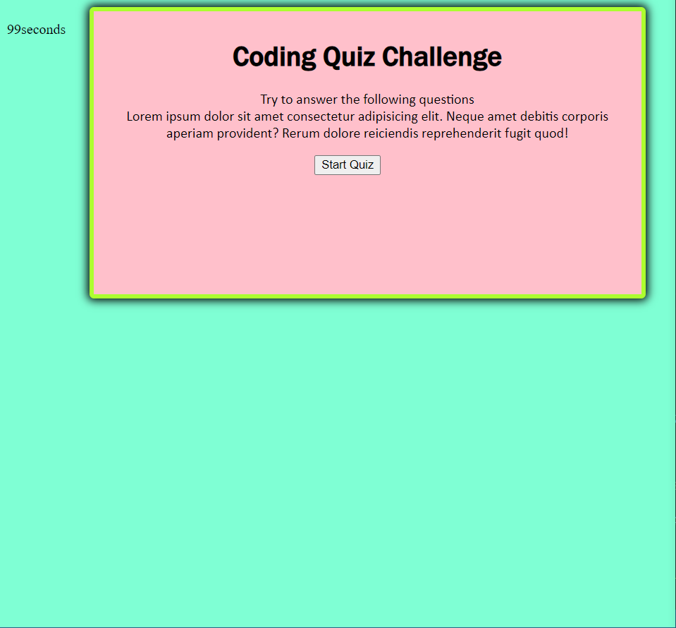
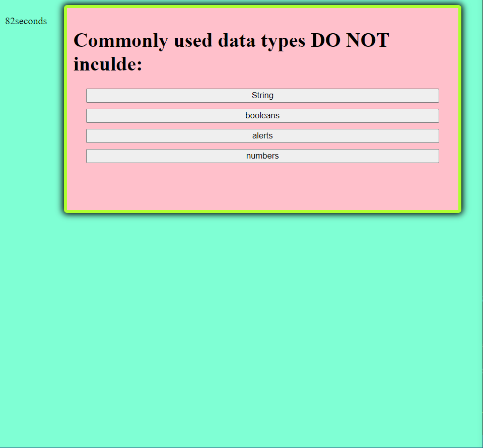
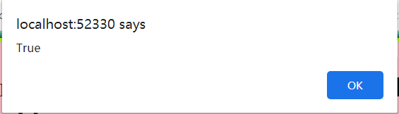
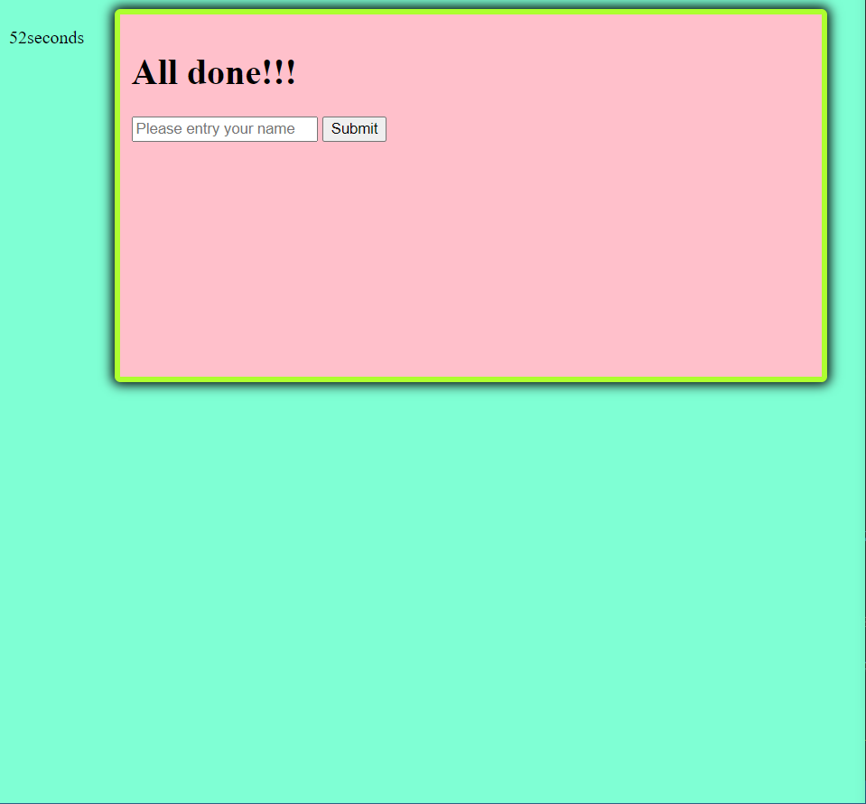
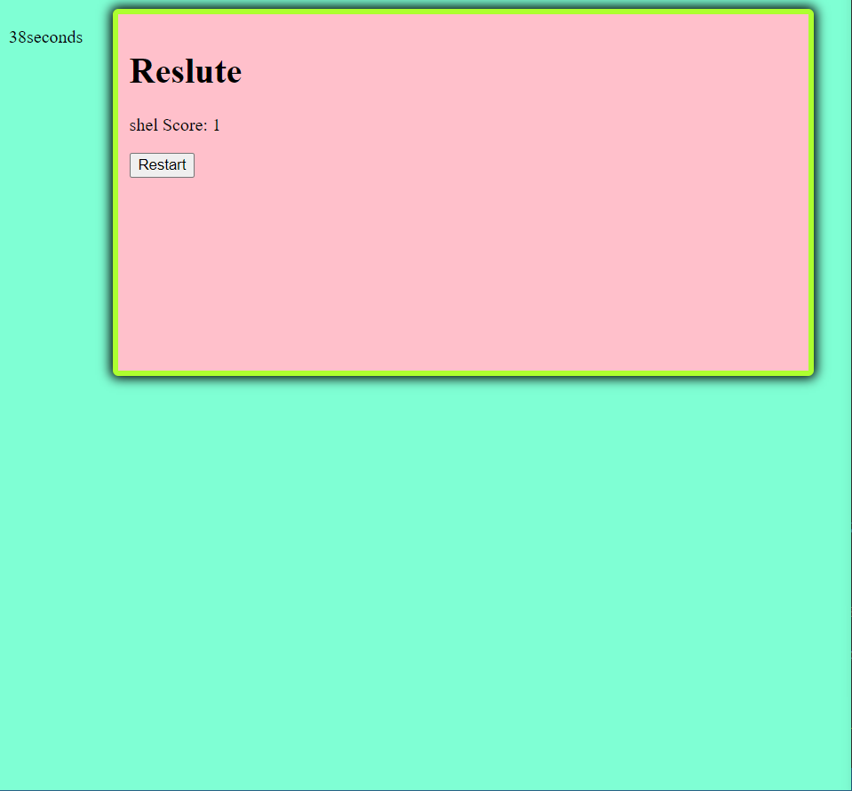

# quize_page
This website is build up for the user that want to test out their coding knowledge.

## Front page of the website 
The front page contain a timer as the user start the game and a start button to click on and start the game. 


* With the javascript I have use 2 function to start the timer and hide the front page and display the question page. 
```js
function startGame() {
    console.log("startPage: " + startPage);
    startPage.style.display = "none";
    questionPage1.style.display = "block";
}


function startTimerfunction() {
    second.textContent = timer + "seconds";
    timer--
    console.log(timer);
    if (timer === 0) {
        
        clearInterval(timeInterval);
    }
}
```

## questions page
For the question page it have contain questionaire with option for the user to pick. 


* When the user have selected the right answer there will be an alert to show they have picking the right answer.


* When showing the alert, there is a function to collect up the scores.
* There is a function to show the random question page by setting up Array and if statement. 

```js
function myFunction() {
    alert("True");
    score++;
}
var questionArray = [questionPage1, questionPage2, questionPage3, questionPage4, questionpage5, pageDone];

function randomQuestion(event) {
    //event.preventDefault();
    const isButton = event.target.nodeName === 'BUTTON';
    if (isButton) {
        questionArray[currentQuestion].style.display = "none";
        currentQuestion++

        if (currentQuestion < questionArray.length) {
            questionArray[currentQuestion].style.display = "block";
        }
    }
}
```
## Submite and result
After finish the quiz there will be a page require to fill in user's name to display their score.



* The function is setting as using the input that user type in and add with the the score count. also by clicking the button to hide the done page and show the score page. 
```js
function submitPage(event) {
    event.preventDefault() ;
    var nameInput = nameText.value
    pageDone.style.display = "none";
    highScore.style.display = "block";
    nameList.textContent = nameInput + " " + "Score: " + score;
}
```